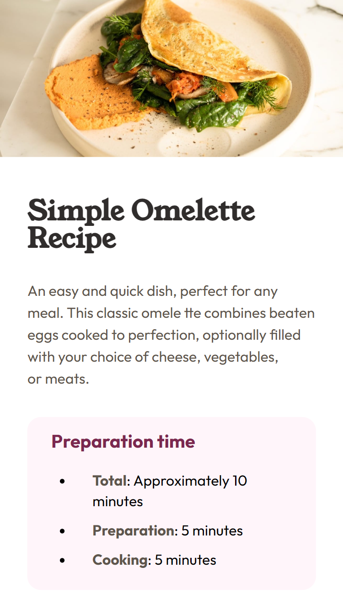

# Frontend Mentor - Recipe page

You can see the **[Recipe page](https://crisscde.github.io/frontend-mentor-solutions/recipe-page/)**

## Description about the project

- For this project I use the [BEM](https://getbem.com/) (Block - Element - Modifier) methodology.
- I learned to use the [@fontface](https://developer.mozilla.org/es/docs/Web/CSS/@font-face) rule to define my own fonts instead of using Google Fonts or other

